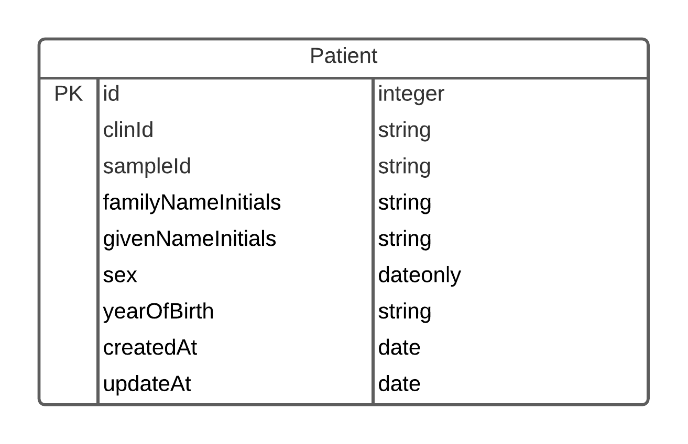

**🛑 Dev and Prod setup instructions are a level up 🛑**
# Wolper Backend

## Tests
The tests ensure that CRUD operations on the database is working correctly, and CSV upload works. These are run with `npm -s test`.

## Database
The database is handled by Sequelize, using SQLite. The file will be created in this directory as `nswhp.db` so ensure there is sufficient permissions to write to this directory.

### Schema

